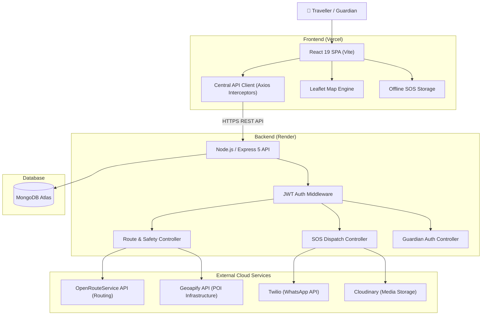
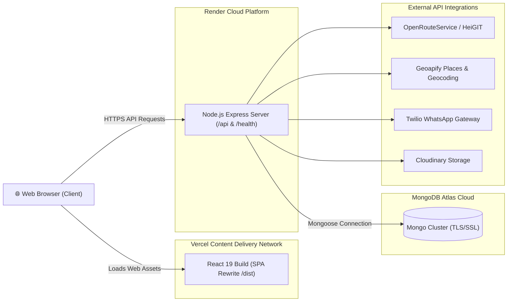
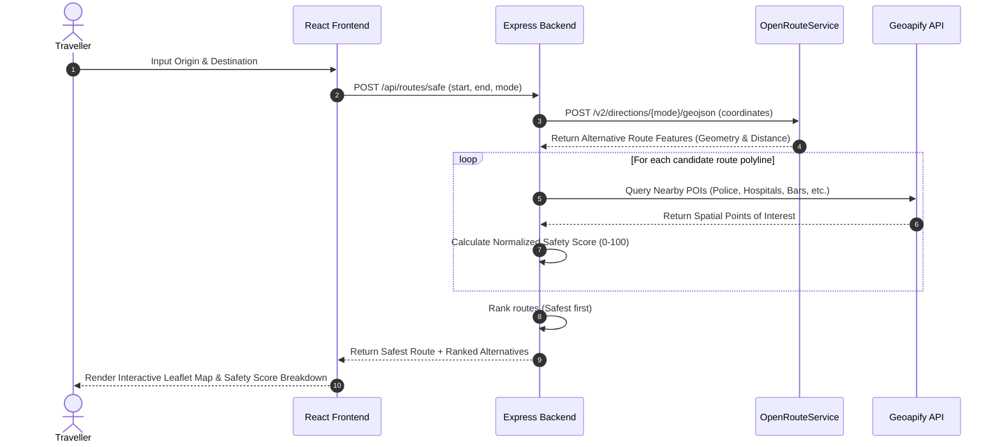
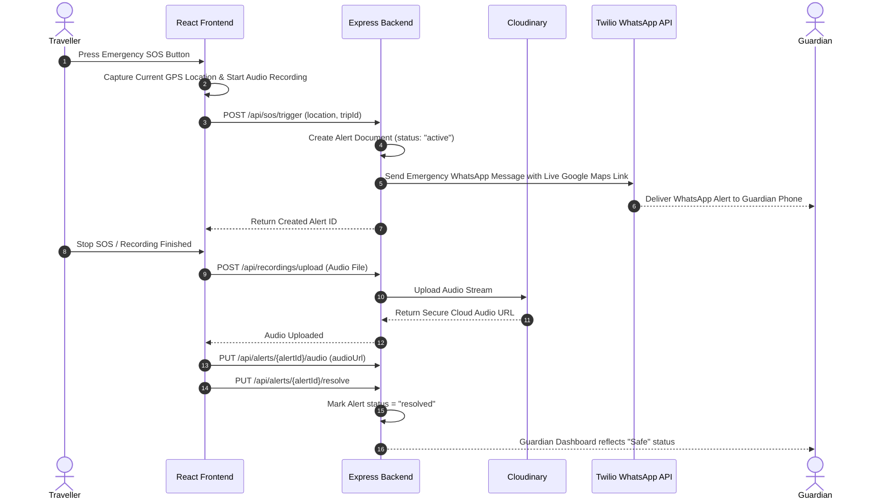
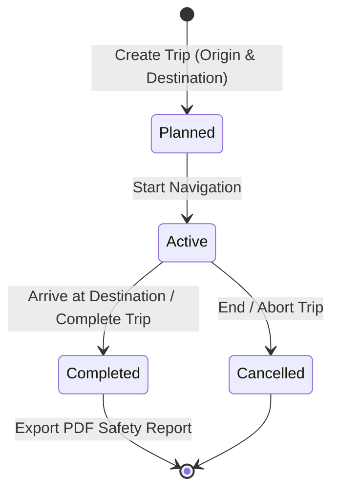

# Sahyatri (सहयात्री) — Smart Travel Safety & Navigation Platform

> *"Not just the fastest route — a safer route."*

**Sahyatri** ("Travel Companion") is a production-grade, full-stack web platform engineered to empower solo commuters, night travelers, and vulnerable individuals with infrastructure-aware safe routing, emergency SOS dispatch, ambient audio recording, and verified guardian monitoring networks.

Unlike conventional navigation systems that optimize purely for distance or travel time, Sahyatri evaluates route options against surrounding safety infrastructure—such as police stations, 24/7 hospitals, illuminated commercial zones, and risk-correlated venue densities—presenting commuters with actionable safety scores alongside standard navigation metrics.

---

## 🔗 Live Deployment

- **Frontend Application (Vercel)**: [https://sahyatri-self.vercel.app/](https://sahyatri-self.vercel.app/)
- **Backend API (Render)**: [https://sahyatri-ybnh.onrender.com](https://sahyatri-ybnh.onrender.com)

---

## 🎯 Problem Statement & Core Concept

Traditional routing engines follow a single-objective optimization paradigm:

```
Origin + Destination ➔ Distance / Traffic Optimization ➔ Shortest / Fastest Route
```

However, the shortest or fastest route is not always the safest route—especially during night travel or solo commuting through unlit or secluded stretches.

Sahyatri introduces spatial safety infrastructure scoring into the navigation engine:

```
Origin + Destination ➔ Multi-Route Calculation (ORS) ➔ Spatial Infrastructure Analysis (Geoapify) ➔ Safety Scoring Engine ➔ Safest Ranked Route
```

---

## 🛠️ Technology Stack

| Layer | Technologies & Libraries |
| :--- | :--- |
| **Frontend Framework** | React 19, Vite, React Router DOM v7 |
| **Styling & Motion** | Tailwind CSS v4, PostCSS, Framer Motion |
| **Interactive Mapping** | Leaflet, React-Leaflet |
| **HTTP & PDF Utilities** | Axios (Centralized Interceptors), Lucide React, jsPDF |
| **Backend Runtime** | Node.js, Express 5 (ES Modules) |
| **Database & ODM** | MongoDB Atlas, Mongoose ODM |
| **Authentication & Security**| JWT (JSON Web Tokens), `bcryptjs`, Protected Middleware, CORS |
| **File & Media Handling** | Multer (Memory Storage), Cloudinary SDK |
| **External Service APIs** | OpenRouteService (ORS), Geoapify API, Twilio (WhatsApp API) |

---

## 💡 Core Features

### 1. Safe Navigation & Infrastructure Safety Scoring
- **Multi-Route Generation**: Fetches route alternatives between origin and destination coordinates using OpenRouteService (ORS).
- **Spatial Infrastructure Lookup**: Samples coordinate points along route polylines to query Geoapify POIs within a specified radius.
- **Safety Algorithm**: Evaluates positive anchors (police stations, hospitals, 24/7 pharmacies, illuminated financial centers) against negative risk factors (unlit areas, bar/pub density) to calculate a normalized safety score (0–100).
- **Safest Route Ranking**: Ranks candidate routes, highlighting the primary recommended safe route alongside alternatives.

### 2. Emergency SOS Alert Dispatch
- **Instant Distress Trigger**: One-tap emergency SOS activation with real-time GPS coordinate capture.
- **WhatsApp/SMS Guardian Dispatch**: Automatically constructs and dispatches emergency alert messages via Twilio, including live Google Maps location links and traveller details.
- **Distress PIN Support**: Allows silent distress logins or cancellations verified via hashed distress PINs.
- **Offline SOS Queue**: Captures distress alerts locally in browser storage when internet drops, automatically syncing to the backend once connectivity is restored.

### 3. Guardian Management Network
- **Verified Traveller-Guardian Pairing**: Travellers link trusted contacts by verified email and phone number.
- **Server-Side Authorization**: Ensures guardians can only monitor travellers who have explicitly added them as a guardian.
- **Guardian Dashboard**: Designated guardians receive live visibility into active distress alerts, last known location coordinates, and traveller safety statuses.

### 4. Emergency Audio Recording & Cloud Hosting
- **Ambient Audio Capture**: Records browser microphone audio during active SOS distress triggers.
- **Secure Cloud Storage**: Streams audio buffers via Multer to Cloudinary, binding the hosted media URL directly to the corresponding emergency alert document.

### 5. Trip Lifecycle Management
- **State Machine**: Tracks trip lifecycles (`Planned` ➔ `Active` ➔ `Completed` / `Cancelled`).
- **Active Navigation Tracking**: Monitors user progress along the active polyline, calculating remaining distance, ETA, and route deviation.
- **Automatic Alert Resolution**: Resolves active emergency alerts upon successful trip completion or explicit SOS termination.

### 6. Safety Reports & PDF Export
- Generates downloadable PDF trip summaries containing start/destination addresses, calculated safety scores, timestamp logs, and route details using `jsPDF`.

---

## 🏗️ System Architecture & Workflows

### System Architecture Diagram



---

### Production Deployment Diagram



---

### Safe Route Recommendation Workflow



---

### Emergency SOS Workflow



---

### Trip Lifecycle State Machine



---

## 📂 Project Structure

```text
Sahyatri/
├── Backend/
│   ├── config/              # Database (MongoDB) & Cloudinary configuration
│   ├── controllers/         # API Controllers (Auth, SOS, Trip, Route, Guardian, Alert, Recording)
│   ├── middleware/          # JWT protection & Multer upload limits middleware
│   ├── models/              # Mongoose Schemas (User, Trip, Alert, GuardianRelationship)
│   ├── routes/              # Express API Endpoint Definitions
│   ├── services/            # ORS & Geoapify API connectors
│   ├── utils/               # Safety score calculator & WhatsApp notification dispatcher
│   ├── index.js             # Express application entry point
│   ├── package.json         # Node.js dependencies and start scripts
│   └── .env.example         # Backend environment variable template
│
├── Frontend/
│   ├── public/              # Static public assets
│   ├── src/
│   │   ├── components/      # UI components (LiveMap, SOSButton, SafetyCheckModal, TripCard, Navbar)
│   │   ├── context/         # AuthContext & ActiveTripContext state providers
│   │   ├── hooks/           # Custom React hooks (useAuth)
│   │   ├── pages/           # Views (Home, Login, Register, Dashboard, GuardianDashboard, TripPage)
│   │   ├── services/        # API service clients
│   │   └── utils/           # Centralized Axios client & offline queue manager
│   ├── vercel.json          # SPA rewrite rules for Vercel deployment
│   ├── package.json         # React dependencies and build scripts
│   └── .env.example         # Frontend public environment variable template
│
├── .gitignore               # Git untracked pattern definitions
└── README.md                # Documentation
```

---

## 💻 Local Development Setup

### Prerequisites
- **Node.js**: v18.0.0 or higher
- **npm**: v9.0.0 or higher
- **MongoDB Atlas** or local MongoDB server

### 1. Clone Repository
```bash
git clone https://github.com/vrushabhdarekar22/Sahyatri.git
cd Sahyatri
```

### 2. Backend Setup
```bash
cd Backend
npm install
```
Create a `.env` file inside `Backend/` (refer to `.env.example` below), then start the development server:
```bash
npm run dev
```
Backend will start on `http://localhost:5000`.

### 3. Frontend Setup
In a new terminal window:
```bash
cd Frontend
npm install
```
Create a `.env` file inside `Frontend/` (refer to `.env.example` below), then start Vite dev server:
```bash
npm run dev
```
Frontend will start on `http://localhost:5173`.

---

## 🔐 Environment Variables

> **Security Note**: Never commit `.env` files or actual API credentials to GitHub. Use the templates below as references.

### `Backend/.env.example`
```env
NODE_ENV=development
PORT=5000

# Database
MONGO_URI=your_mongodb_connection_string

# Security
JWT_SECRET=your_jwt_secret_key
CLIENT_URL=http://localhost:5173

# External Services
TWILIO_SID=your_twilio_account_sid
TWILIO_AUTH_TOKEN=your_twilio_auth_token
TWILIO_WHATSAPP_NUMBER=whatsapp:+14155238886

CLOUDINARY_CLOUD_NAME=your_cloudinary_cloud_name
CLOUDINARY_API_KEY=your_cloudinary_api_key
CLOUDINARY_API_SECRET=your_cloudinary_api_secret

ORS_API_KEY=your_openrouteservice_api_key
GEOAPIFY_API_KEY=your_geoapify_api_key
```

### `Frontend/.env.example`
```env
VITE_API_URL=http://localhost:5000/api
VITE_GEOAPIFY_API_KEY=your_geoapify_api_key
```

---

## 🚀 Production Deployment Overview

The application is deployed across multi-cloud infrastructure:

- **Frontend Deployment**: **Vercel**
  - Continuous deployment connected to the `main` branch.
  - SPA rewrite rules defined in `vercel.json` to route direct client-side paths (`/dashboard`, `/guardian`, `/trip`) to `/index.html`.
- **Backend Deployment**: **Render**
  - Node.js Express environment running on port assigned by container.
  - Unauthenticated health check endpoint configured at `GET /health`.
- **Database**: **MongoDB Atlas**
  - Cloud hosted database cluster with network access configuration.
- **Media & Cloud Storage**: **Cloudinary**
  - Direct server-side streaming for emergency audio recordings.

---

## ⚙️ Engineering Highlights

- **Spatial Safety Infrastructure Algorithm**: Implements polyline coordinate sampling to evaluate spatial POI densities using weight-based heuristics without incurring excessive third-party API rate overhead.
- **Server-Side Authorization Matrix**: Enforces strict Mongoose query filters (`{ traveller: userId, guardian: guardianId }`) so users cannot view or manipulate unauthorized trip logs or location streams.
- **Centralized Axios Interceptor Pipeline**: Employs single-instance request interceptors to automatically attach JWT authorization headers and handle global error responses cleanly.
- **Resilient External Service Fallbacks**: Integrates API host fallbacks (supporting both HeiGIT and legacy ORS endpoints) to ensure routing continuity during third-party domain deprecations.
- **Robust Media Streaming Pipeline**: Uses Multer memory storage buffers with strict 10MB size limits and mime-type guards before uploading ambient audio recordings to Cloudinary.

---

## 💡 Key Technical Challenges

1. **Spatial POI & Polyline Mapping**: Standard directions APIs return polyline coordinate arrays containing hundreds of points. Sampling these coordinates strategically allows nearby safety infrastructure analysis without exceeding API rate limits.
2. **State & Alert Lifecycle Synchronization**: Distinguishing between active and resolved SOS distress alerts across unmount/remount navigation cycles required implementing server-side alert status fields (`"active"` vs `"resolved"`) alongside local storage backup synchronization.
3. **Decoupled Cross-Origin Authentication**: Configuring production-safe CORS policies across distinct deployment domains (Vercel frontend and Render backend) while ensuring secure JWT access header transmission.
4. **Third-Party Service Resiliency**: Wrapping external service calls (Twilio, Cloudinary, Geoapify, ORS) in try/catch blocks with user-safe error messages to prevent third-party outages from crashing the core application.

---

---

## 👤 Author

**Vrushabh Darekar**

- **GitHub**: [https://github.com/vrushabhdarekar22](https://github.com/vrushabhdarekar22)
- **LinkedIn**: [https://www.linkedin.com/in/vrushabh-darekar/](https://www.linkedin.com/in/vrushabh-darekar/)
- **Project Repository**: [https://github.com/vrushabhdarekar22/Sahyatri](https://github.com/vrushabhdarekar22/Sahyatri)
